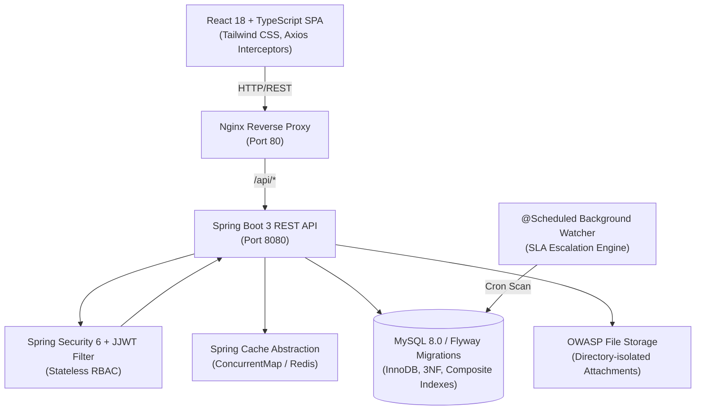
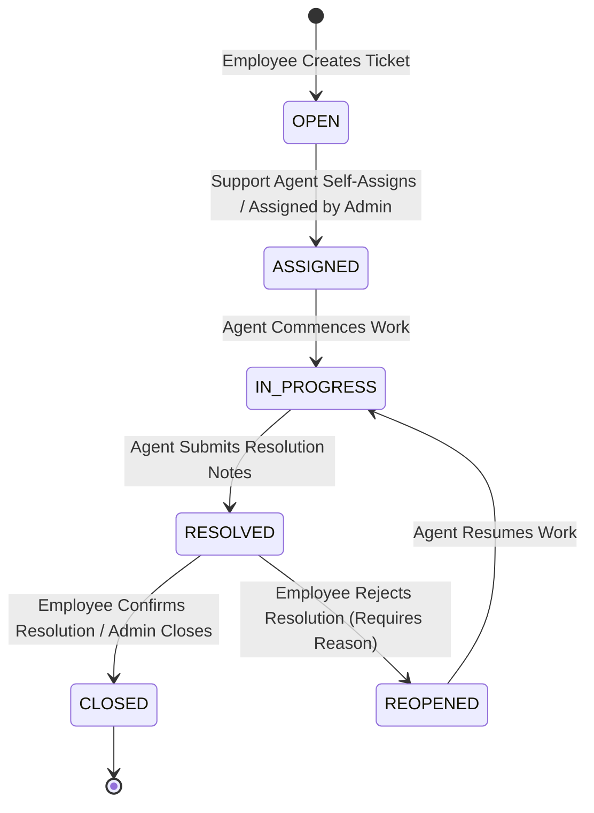
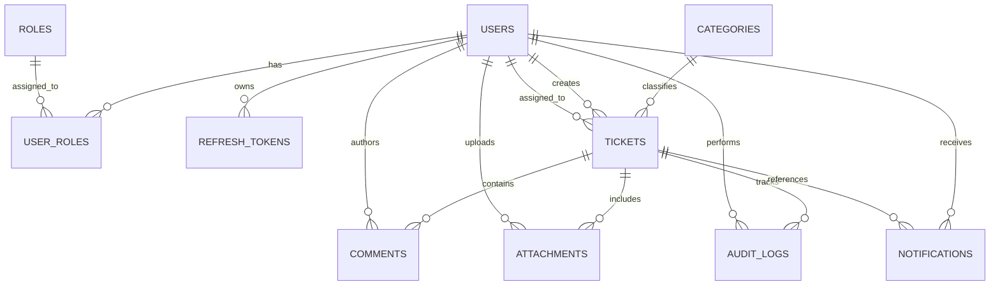

# ServiceDesk Pro — Enterprise IT Service Management System (ITSM)

[](https://www.oracle.com/java/)
[](https://spring.io/projects/spring-boot)
[](https://spring.io/projects/spring-security)
[](https://www.mysql.com/)
[](https://flywaydb.org/)
[](https://reactjs.org/)
[](https://www.typescriptlang.org/)
[](https://tailwindcss.com/)
[](https://www.docker.com/)

---

## 📌 Executive Summary

**ServiceDesk Pro** is a production-grade, enterprise-scale **IT Service Management (ITSM) Platform** built using modern **Java 17+, Spring Boot 3, Spring Security 6, Hibernate / JPA, Flyway, MySQL 8.0, and React 18 + TypeScript**.

Designed to model real-world corporate IT governance standards (such as **ITIL Incident Management** and **SOC 2 Type II audit compliance**), the system streamlines incident ticketing, SLA tracking, role-scoped triaging, threaded communication, secure file transfers, and automated background priority escalations.

---

## 🏛️ System Architecture



---

## 🔄 ITIL Incident Lifecycle State Machine

ServiceDesk Pro enforces a strict, deterministic state machine adhering to ITIL standards:



### State Transition Validation Matrix
| From Status | Permitted Target Statuses | Authorized Actors |
| :--- | :--- | :--- |
| `OPEN` | `ASSIGNED`, `CLOSED` | Support Agent, Admin |
| `ASSIGNED` | `IN_PROGRESS`, `ASSIGNED` (Reassign), `CLOSED` | Support Agent, Admin |
| `IN_PROGRESS` | `RESOLVED`, `ASSIGNED` (Reassign), `CLOSED` | Assigned Agent, Admin |
| `RESOLVED` | `CLOSED` (Verification), `REOPENED` (Rejection) | Ticket Creator, Admin |
| `REOPENED` | `IN_PROGRESS`, `CLOSED` | Support Agent, Admin |
| `CLOSED` | Terminal State (Immutable) | — |

---

## 🗄️ Database Entity Relationship Model

The relational schema is in **Third Normal Form (3NF)**, managed with version-controlled **Flyway migrations** (`V1__create_initial_schema.sql`, `V2__seed_master_data.sql`).



---

## 🚀 Key Engineering Highlights

1. **Enterprise Security & Token Rotation:**
   - **HMAC-SHA256 JWT** access tokens with short TTL (15 minutes).
   - **Database-backed Refresh Token Rotation** with automatic single-use revocation.
   - **Spring Security 6 Method Security** (`@PreAuthorize("hasRole('ADMIN')")`).
   - Centralized Axios Interceptor with automatic silent token refresh on HTTP 401s.

2. **JPA Performance & N+1 Prevention:**
   - Eager-loading traps eliminated with `FetchType.LAZY` on all `@ManyToOne` and `@OneToMany` relations.
   - Bulk ticket list queries use `@EntityGraph(attributePaths = {"category", "createdBy", "assignedTo"})` to fetch complete graph in a single SQL `LEFT JOIN`.
   - Strategic composite indexes (`idx_tickets_status_priority`, `idx_notifications_recipient_read`).

3. **Dynamic Filtering with JPA Criteria API:**
   - `TicketSpecification.java` builds dynamic SQL predicates safely without SQL injection risk.
   - Supports multi-criteria filtering (`status`, `priority`, `categoryId`, `assignedToId`, `unassignedOnly`, case-insensitive keyword `search`).
   - Strict role-based scoping: Employees see only their own tickets; Support Agents and Admins see organizational queues.

4. **Automated Background SLA Breach Escalation:**
   - `@Scheduled` cron job scans for active tickets (`OPEN`, `ASSIGNED`, `IN_PROGRESS`, `REOPENED`) where `slaDueAt < now()`.
   - Automatically escalates priority to `CRITICAL`, alerts assigned agents via in-app notification, and logs an immutable audit event.

5. **In-Memory Caching (`@Cacheable` / `@CacheEvict`):**
   - High-read, low-mutation master data (Service Categories & SLAs) cached in-memory with automatic eviction on writes.

6. **OWASP-Compliant File Upload Storage:**
   - Strict MIME and file extension validation (`PDF`, `PNG`, `JPG`, `DOCX`, `TXT`, `ZIP`).
   - File size caps (10MB max).
   - Storage path randomization with UUIDs and directory isolation to prevent path traversal attacks.

7. **Docker Multi-Stage Builds:**
   - Backend built with Maven 3.9 + Temurin 17 JRE runtime (running as non-root user).
   - Frontend built with Node 20 and served via Nginx Alpine reverse proxy.
   - Single command deployment via `docker-compose.yml`.

---

## ⚡ Quickstart & Local Setup

### Prerequisites
- **Java 17+ JDK**
- **Maven 3.9+**
- **MySQL 8.0+**
- **Node.js 18+ & npm** (for frontend)
- *Optional:* **Docker & Docker Compose**

---

### Option A: Running with Docker Compose (Recommended)

```bash
# 1. Clone repository
git clone https://github.com/your-username/servicedesk-pro.git
cd servicedesk-pro

# 2. Build and launch all containers (MySQL, Spring Boot API, React + Nginx)
docker-compose up --build
```
- Frontend UI: `http://localhost`
- Backend Swagger UI: `http://localhost:8080/swagger-ui/index.html`

---

### Option B: Running Locally for Development

#### 1. Backend Setup
```bash
# Navigate to backend directory
cd backend

# Configure MySQL credentials in src/main/resources/application-dev.yml if needed
# Create database in MySQL:
# CREATE DATABASE servicedesk_db;

# Run Spring Boot backend with dev profile
mvn spring-boot:run -Dspring-boot.run.profiles=dev
```
Backend will start on `http://localhost:8080`. Flyway will automatically create the tables and seed default accounts.

#### 2. Frontend Setup
```bash
# Navigate to frontend directory
cd ../frontend

# Install dependencies
npm install

# Start Vite dev server
npm run dev
```
Frontend will start on `http://localhost:5173`.

---

## 👥 Default Seed Accounts (Out of the Box)

| Role | Username | Password | Purpose |
| :--- | :--- | :--- | :--- |
| **System Admin** | `admin` | `Admin@123` | Master governance, user & agent management, audit logs |
| **Support Agent** | *(Provision via Admin or Register)* | `Agent@123` | Queue triage, self-assignment, resolution |
| **Employee** | *(Self-register on `/register`)* | `User@123` | Ticket creation, tracking, comment discussion |

---

## 🧪 Automated Testing Suite

To run the complete automated test suite across all layers (Repositories, State Machine, Security, JPA Specifications, Comments, Attachments, Notifications, Admin Governance, SLA Watcher, Caching):

```bash
cd backend
mvn test
```

```
[INFO] Results:
[INFO] Tests run: 21, Failures: 0, Errors: 0, Skipped: 0
[INFO] BUILD SUCCESS
```

---

## 📄 License & Author

- **Author:** Java Full-Stack Software Engineer
- **Project:** ServiceDesk Pro Enterprise ITSM
- **License:** MIT License